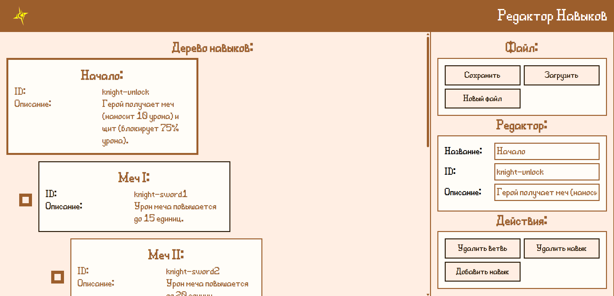

## Редактор дерева навыков для игры `Heroes of Envell`

### Как установить

1. Скачать [локальный сервер](https://github.com/Rul991/envell-tools-local-server/releases/latest) и установить его по [гайду](https://github.com/Rul991/envell-tools-local-server?tab=readme-ov-file#%D0%BA%D0%B0%D0%BA-%D0%B8%D1%81%D0%BF%D0%BE%D0%BB%D1%8C%D0%B7%D0%BE%D0%B2%D0%B0%D1%82%D1%8C)
2. Скачать [редактор навыков](https://github.com/Rul991/skill-tree-maker/releases/latest)
3. Перейти в место, где распакован `локальный сервер`. Перейти в подпапку `sites/`. Распаковать туда архив с редактором навыков. Должно получить `sites/skill-tree`.
4. Перейти по ссылке [`localhost:3000/skill-tree`](localhost:3000/skill-tree)
5. ...
6. **ПРОФИТ!!!**

### Ссылки

- *Репозиторий движка игры*: [*Клик*](https://github.com/traeterno/Ae2D) 